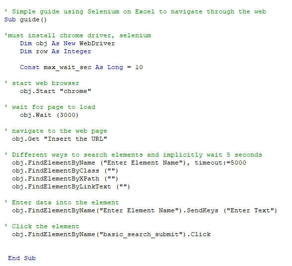

# Simple-VBA-Selenium-Guide

This is a simple guide to navigate through Chrome using Selenium &amp; VBA
This can be utiltized to various projects like automate web scraping / automate data entry / bring data into Excel for data analysis

